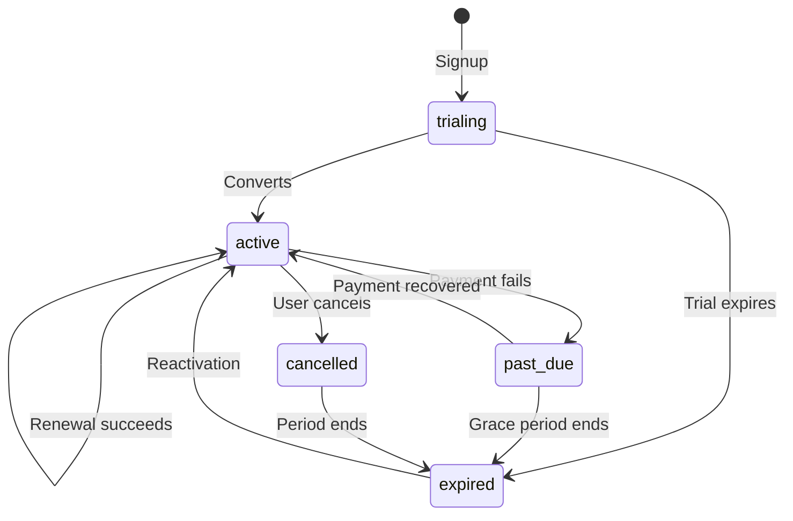
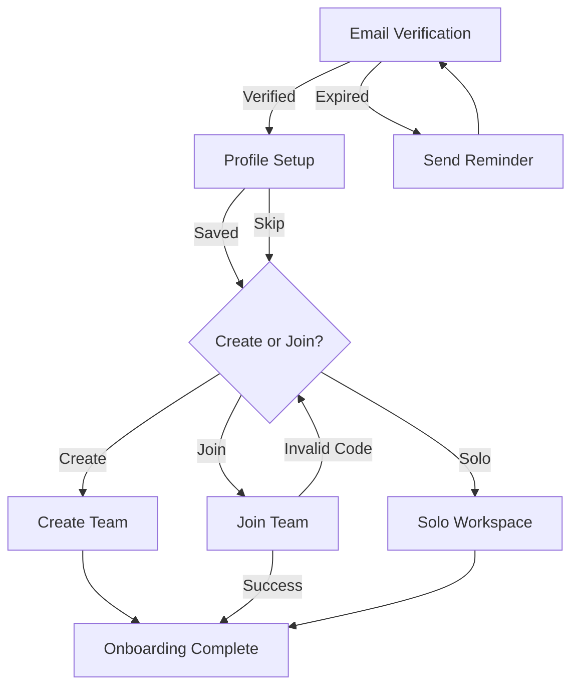
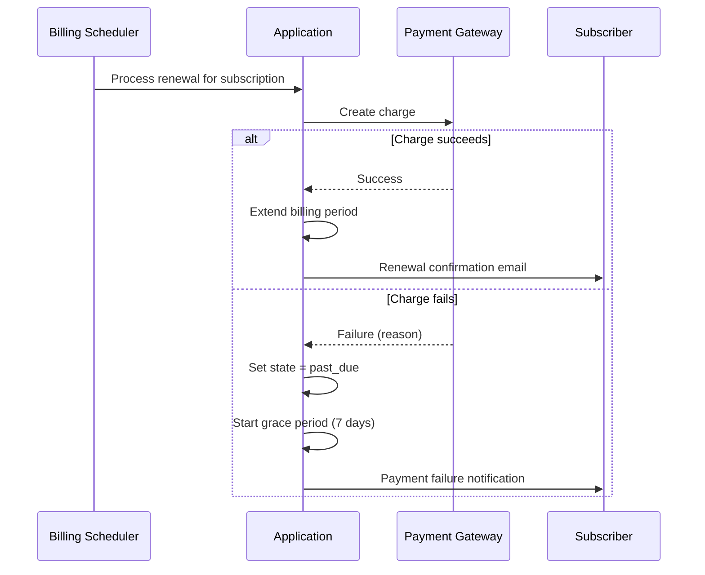
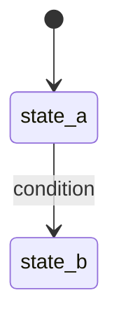

# PBC Specification — Appendix: GFM Conventions

**Applies to:** PBC Spec v0.5+  
**Baseline:** GitHub Flavored Markdown (GFM)  
**Date:** March 2026

---

## 1. Why GFM

PBC specifies **GitHub Flavored Markdown (GFM)** as the baseline Markdown
dialect. All `.pbc.md` files must be valid GFM. This ensures consistent
rendering across GitHub, GitLab, VS Code, and the PBC viewer toolchain.

GFM extends CommonMark with features that PBC uses extensively:

| Feature | CommonMark | GFM | PBC Usage |
|---------|-----------|-----|-----------|
| Tables | ❌ | ✅ | Human-readable preview of structured data |
| Task lists | ❌ | ✅ | Review tracking, acceptance checklists |
| Strikethrough | ❌ | ✅ | Deprecated behaviors and rules |
| Autolinks | ❌ | ✅ | Issue/PR references in provenance |
| Footnotes | ❌ | ✅ | Design rationale, regulatory references |
| Alerts | ❌ | ✅ | Design decisions, warnings, regulatory notes |
| `<details>` | Varies | ✅ | Collapsible `pbc:*` blocks (dual rendering) |
| Mermaid | ❌ | ✅ | State diagrams, workflow flowcharts |

---

## 2. Review Tracking with Task Lists

### Behavior-level review

Each behavior can include a review checklist after its contract blocks.
This replaces or supplements the document-level `status` field with
granular per-behavior tracking.

```markdown
### BHV-002: Renewal Payment Failure

> 🎭 **Actor:** Billing Scheduler

#### Given (Preconditions)
...

#### Then (Outcomes)
...

<details>
<summary>📎 pbc:behavior + blocks</summary>
...
</details>

#### Review

- [x] PM reviewed — @alice, 2026-03-08
- [x] Eng reviewed — @bob, 2026-03-09
- [ ] QA reviewed
- [ ] Acceptance tests written (see #342)
```

### Document-level review

The document header can track overall review status:

```markdown
# Billing & Subscriptions

> **PBC** · `pbc-billing` · v1.0.0

#### Review Status

- [x] Initial draft — @alice, 2026-02-28
- [x] Engineering review — @bob, 2026-03-05
- [x] QA review — @carol, 2026-03-07
- [x] Three Amigos sign-off — 2026-03-08
- [ ] Quarterly re-review (due 2026-06-08)
```

### Parseable convention

Tools can extract review status from task lists by matching the pattern:

```
- [x] <role> reviewed — @<user>, <date>
- [ ] <role> reviewed
```

For the first public package, keep review tracking as a Markdown checklist
convention rather than introducing a separate review block type.

---

## 3. Alerts for Design Context

GFM supports five alert types. PBC assigns specific semantic meaning
to each:

### `[!NOTE]` — Design Decisions

Explains **why** a behavior works the way it does. Not a contract —
context for understanding.

```markdown
> [!NOTE]
> We retry on days 1, 3, and 6 (not daily) because Stripe's documentation
> suggests that spacing retries improves recovery rates. The day-6 retry
> is the last attempt before grace period expiry on day 7.
```

### `[!TIP]` — Implementation Guidance

Suggests **how** to implement, without being prescriptive. Useful for
agents and new developers.

```markdown
> [!TIP]
> The grace period calculation should use UTC calendar days, not elapsed
> hours. Use `date_trunc('day', ...)` in queries to avoid timezone edge
> cases.
```

### `[!IMPORTANT]` — Key Contracts

Highlights a **critical product promise** that is easy to miss or break.

```markdown
> [!IMPORTANT]
> The grace period is NOT reset when a payment update fails. This prevents
> abuse where someone could extend the grace period indefinitely by
> submitting invalid payment methods.
```

### `[!WARNING]` — Regulatory / Compliance

Flags **legal or regulatory constraints** that code must respect.

```markdown
> [!WARNING]
> The FTC's "click-to-cancel" rule requires that cancellation be no harder
> than sign-up. Our current flow is 2 clicks from account settings. Do not
> add friction (confirmation dialogs, surveys, wait periods) without legal
> review.
```

### `[!CAUTION]` — Breaking Change Risk

Marks areas where changes could **break existing behavior** or cause
data loss.

```markdown
> [!CAUTION]
> Changing the grace period from 7 to 14 days affects all in-flight
> past_due subscriptions. This requires a migration plan for existing
> subscriptions. Do not change this value without a data migration PR.
```

---

## 4. Footnotes for Deep Rationale

Use footnotes for detailed justification, regulatory citations, or
historical context that would clutter the main flow.

```markdown
### BHV-003: Grace Period Expiry

...

4. Subscriber data is retained (not deleted) for 90 days.[^1]

[^1]: The 90-day retention period is driven by GDPR Article 17(3)(e)
    which permits retention for the establishment, exercise, or defense
    of legal claims. Our legal team confirmed 90 days as the minimum
    defensible period in the 2025-Q4 compliance review. See the product's
    published retention policy and compliance review record. If this period
    changes, update both this PBC and `pbc-data-retention`.
```

Footnotes keep the behavior contract clean while preserving the
full reasoning chain for audits and future decisions.

---

## 5. Strikethrough for Deprecation

When a behavior or rule is deprecated but not yet removed, use
strikethrough to mark it visually while keeping it in the document
for historical context.

```markdown
### ~~BHV-006: Manual Invoice Generation~~

> **Deprecated in v2.0.0** — Replaced by automatic invoice generation
> in BHV-012. Scheduled for removal in v3.0.0.

~~This behavior allowed admins to manually trigger invoice generation
for a specific subscriber.~~
```

The structured block should also reflect the deprecation:

```pbc:behavior
- id: BHV-006
  name: Manual Invoice Generation
  status: deprecated
  deprecated_in: "2.0.0"
  replaced_by: BHV-012
  removal_target: "3.0.0"
  actor: support_agent
```

---

## 6. Autolinks for Provenance

GFM autolinks issue references (#123), PR references, commit SHAs,
and URLs. Use these in behavior notes and provenance sections for
lightweight traceability.

```markdown
> [!NOTE]
> Implemented in #342. Payment retry schedule tuned in #387 based on
> Stripe's updated recommendations. Original design discussion: #298.
```

For structured provenance, use the `pbc:provenance` block. Autolinks
in prose provide the informal, fast version. Both can coexist:

```markdown
> Implemented in #342, tested in #358.

<details>
<summary>📎 pbc:provenance</summary>

```pbc:provenance
- kind: code
  ref: "src/billing/renewal.ts#L142-L198"
  detail: Renewal charge submission and success-path behavior.
  confidence: verified
  rationale: Implemented in PR #342.
- kind: test
  ref: "tests/billing/renewal.spec.ts"
  detail: Renewal success and failure coverage.
  confidence: verified
  rationale: Covered by test run #358.
```

</details>
```

---

## 7. Mermaid Diagrams

GFM (via GitHub and VS Code with extensions) renders Mermaid diagrams
natively. PBC uses Mermaid for:

### State Diagrams

Every PBC with a `pbc:states` block should include a Mermaid
`stateDiagram-v2` showing the valid transitions.



### Workflow Flowcharts

Workflows (`pbc:workflow` + `pbc:steps`) should include a Mermaid
flowchart showing the step sequence.



### Sequence Diagrams (optional)

For complex multi-actor behaviors, a sequence diagram can clarify
the interaction:



---

## 8. Extended Table Features

GFM tables support alignment and are used in PBC for human-readable
previews. Conventions:

### Alignment

- Left-align text columns (default).
- Center-align status and access columns.
- Right-align numeric values.

```markdown
| State | Definition | Access |
|:------|:-----------|:------:|
| `active` | Paid and current. | ✅ Full |
| `expired` | Grace period ended. | ❌ None |
```

### Emoji conventions in tables

| Emoji | Meaning |
|:-----:|---------|
| ✅ | Full access / enabled / yes |
| ❌ | No access / disabled / no |
| ⚠️ | Limited / degraded / warning |
| 🟢 | Active / healthy state |
| 🟡 | Transitional / at-risk state |
| 🔴 | Terminal / error state |
| 🛑 | Enforcement: prevent |
| ⚡ | Enforcement: warn |
| 📝 | Enforcement: log |

---

## 9. Template: GFM-Optimized PBC File

A complete template incorporating all GFM conventions:

````markdown
---
id: pbc-<context>-<feature>
title: <Feature Name>
context: <Bounded Context>
version: "0.1.0"
status: draft
owners: ["@pm", "@eng", "@qa"]
last_updated: "2026-03-10"
tags: [<tag1>, <tag2>]
---

# <Feature Name>

> **PBC** · `pbc-<id>` · v0.1.0 · **Draft**
> **Context:** <Context> · **Updated:** 2026-03-10
> **Owners:** @pm (PM) · @eng (Eng) · @qa (QA)

Brief description of what this feature does and why it matters.

#### Review Status

- [ ] PM reviewed
- [ ] Eng reviewed
- [ ] QA reviewed

---

## 📖 Glossary

| Term | Definition |
|------|-----------|
| **Term A** | What it means. |
| **Term B** | What it means. |

<details>
<summary>📎 <code>pbc:glossary</code></summary>

```pbc:glossary
- term: Term A
  definition: What it means.
- term: Term B
  definition: What it means.
```

</details>

---

## 🔄 States

| State | Definition | Access |
|:------|:-----------|:------:|
| 🟢 `state_a` | Description. | ✅ Full |
| 🔴 `state_b` | Description. | ❌ None |



<details>
<summary>📎 <code>pbc:states</code></summary>

```pbc:states
- id: state_a
  definition: Description.
  user_access: full
- id: state_b
  definition: Description.
  user_access: none
```

</details>

---

## 📋 Behaviors

### BHV-001: <Behavior Name>

> 🎭 **Actor:** <Actor Name> · <type>

Brief context for why this behavior matters.

#### Given (Preconditions)

- First precondition.
- Second precondition.

#### When (Trigger)

Description of what initiates this behavior.

#### Then (Outcomes)

1. First outcome.
2. Second outcome.

#### Events & Transitions

| Event | Condition |
|-------|-----------|
| `event.name` | Always |

| From | → | To | Condition |
|:-----|:-:|:---|:----------|
| 🟢 state_a | → | 🟢 state_a | condition |

> [!IMPORTANT]
> Key contract detail that is easy to miss.

> [!NOTE]
> Design rationale for this behavior.[^1]

<details>
<summary>📎 <code>pbc:behavior</code> + blocks</summary>

```pbc:behavior
id: BHV-001
name: Behavior Name
actor: actor_id
```

```pbc:preconditions
- First precondition.
- Second precondition.
```

```pbc:trigger
Description of what initiates this behavior.
```

```pbc:outcomes
- First outcome.
- Second outcome.
```

```pbc:events
- event: event.name
  condition: always
  payload: [field_a, field_b]
```

```pbc:transitions
- from: state_a
  to: state_a
  condition: condition
```

</details>

#### Review

- [ ] PM reviewed
- [ ] Eng reviewed
- [ ] QA reviewed
- [ ] Acceptance tests written

---

## 📐 Business Rules

| ID | Rule | Scope | Enforcement |
|:---|:-----|:------|:-----------:|
| **RUL-001** | Rule description. | Scope | 🛑 Prevent |

<details>
<summary>📎 <code>pbc:rules</code></summary>

```pbc:rules
- id: RUL-001
  name: Rule Name
  scope: Scope
  rule: Rule description.
  enforcement: prevent
```

</details>

---

## 📝 Changelog

| Version | Date | Author | Summary |
|:--------|:-----|:-------|:--------|
| 0.1.0 | 2026-03-10 | @author | Initial draft. |

<details>
<summary>📎 <code>pbc:changelog</code></summary>

```pbc:changelog
- version: "0.1.0"
  date: "2026-03-10"
  author: "@author"
  summary: Initial draft.
```

</details>

---

[^1]: Detailed rationale, regulatory citation, or historical context
    that would clutter the main flow.
````

---

## 10. Parser Implications

Deterministic tooling and parser implementations should already handle GFM
correctly when they only parse frontmatter and fenced `pbc:*` blocks, because
both are identical in CommonMark and GFM.

However, future tooling may want to extract:

- **Task list state** from review checklists (checked vs unchecked).
- **Alert types** from `> [!NOTE]` blocks for categorized context extraction.
- **Footnote content** for provenance enrichment.

These are all additive. They do not change the core deterministic parsing
model; they extend future tooling with optional extractors that can be added
later.
