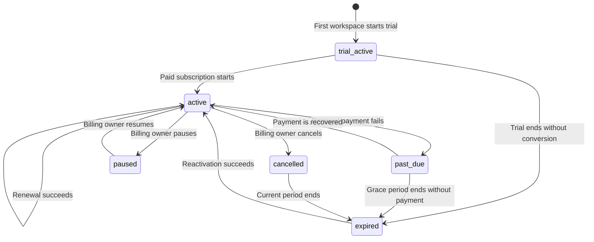

# Billing & Subscriptions

> **PBC** · `pbc-billing-markdown-first` · **Draft**
> **Context:** Billing · **Updated:** 2026-03-19

This worked example shows how a billing and subscriptions surface can be
authored as a Markdown-first PBC.

It keeps the richer readability of a product-facing module document while using
structured `pbc:*` blocks for the canonical contract units.

## Scope

- workspace subscription pricing
- trial and paid subscription states
- renewal, payment failure, and cancellation behavior
- pooled plan limits and metered usage policy

## Non-goals

- payment gateway API details
- invoice object modeling
- ledger or accounting implementation details

## Glossary

| Term | Definition |
| --- | --- |
| Billing account | The paying identity that owns subscriptions and pooled usage. |
| Workspace subscription | One purchased unit of workspace capacity. |
| Billing cycle | The recurring period between charges. |
| Grace period | The limited recovery window after a failed renewal payment. |
| Pooled resources | Usage credits shared across all active owned workspaces. |
| Payment method | A stored payment source used for subscription charges. |

<details>
<summary>📎 <code>pbc:glossary</code></summary>

```pbc:glossary
- term: Billing account
  definition: The paying identity that owns subscriptions and pooled usage.
- term: Workspace subscription
  definition: One purchased unit of workspace capacity.
- term: Billing cycle
  definition: The recurring period between charges.
- term: Grace period
  definition: The limited recovery window after a failed renewal payment.
- term: Pooled resources
  definition: Usage credits shared across all active owned workspaces.
- term: Payment method
  definition: A stored payment source used for subscription charges.
```

</details>

## Actors

| Actor | Type | Description |
| --- | --- | --- |
| Billing owner | Human | The person who buys or manages subscriptions. |
| Billing experience | System | The product surface for plan changes, checkout, and billing self-service. |
| Billing processor | External | The external billing processor that attempts charges and reports success or failure. |
| Billing scheduler | System | The system process that evaluates renewals, retries, and end-of-period transitions. |
| Billing policy | System | The policy layer that evaluates access, trial eligibility, and billing state. |

<details>
<summary>📎 <code>pbc:actors</code></summary>

```pbc:actors
- id: billing_owner
  name: Billing owner
  type: human
  description: The person who buys or manages subscriptions.
- id: billing_experience
  name: Billing experience
  type: system
  description: The product surface for plan changes, checkout, and billing self-service.
- id: billing_processor
  name: Billing processor
  type: external
  description: The external billing processor that attempts charges and reports success or failure.
- id: billing_scheduler
  name: Billing scheduler
  type: system
  description: The system process that evaluates renewals, retries, and end-of-period transitions.
- id: billing_policy
  name: Billing policy
  type: system
  description: The policy layer that evaluates access, trial eligibility, and billing state.
```

</details>

## States

| State | Definition | User access |
| --- | --- | --- |
| `trial_active` | Trial is active and limited usage is allowed. | Limited |
| `active` | Paid subscription is active and pooled usage is allowed. | Full |
| `past_due` | Renewal payment failed and the grace period is in progress. | Full |
| `cancelled` | Renewal is disabled but access continues until the current period ends. | Full |
| `paused` | Subscription is paused and premium usage is blocked. | None |
| `expired` | No active subscription or valid trial remains. | None |

### State Diagram



<details>
<summary>📎 <code>pbc:states</code></summary>

```pbc:states
- id: trial_active
  definition: Trial is active and limited usage is allowed.
  user_access: limited
- id: active
  definition: Paid subscription is active and pooled usage is allowed.
  user_access: full
- id: past_due
  definition: Renewal payment failed and the grace period is in progress.
  user_access: full
- id: cancelled
  definition: Renewal is disabled but access continues until the current period ends.
  user_access: full
- id: paused
  definition: Subscription is paused and premium usage is blocked.
  user_access: none
- id: expired
  definition: No active subscription or valid trial remains.
  user_access: none
```

</details>

## Example Plan Matrix

| Tier | Price | AI scan credits | AI transaction suggestions | AI chat messages |
| --- | --- | ---: | ---: | ---: |
| Lite | $12/month/workspace | 25 | 0 | 20 |
| Growth | $24/month/workspace | 100 | 200 | 50 |
| Pro | $48/month/workspace | 250 | 500 | 120 |

<details>
<summary>📎 <code>pbc:config</code></summary>

```pbc:config
domain: billing_pricing
plans:
  lite:
    billing_interval: monthly_or_annual
    monthly_price_per_workspace_usd: 12
    yearly_price_per_workspace_usd: 120
    monthly_limits:
      ai_scan_credits: 25
      ai_transaction_suggestions: 0
      ai_chat_messages: 20
  growth:
    billing_interval: monthly_or_annual
    monthly_price_per_workspace_usd: 24
    yearly_price_per_workspace_usd: 240
    monthly_limits:
      ai_scan_credits: 100
      ai_transaction_suggestions: 200
      ai_chat_messages: 50
  pro:
    billing_interval: monthly_or_annual
    monthly_price_per_workspace_usd: 48
    yearly_price_per_workspace_usd: 480
    monthly_limits:
      ai_scan_credits: 250
      ai_transaction_suggestions: 500
      ai_chat_messages: 120
trial:
  duration_days: 14
  active_workspace_limit: 2
renewal:
  grace_period_days: 7
  retry_days_after_failure: [1, 3, 6]
overages:
  ai_scan_credit_usd: 0.10
  ai_transaction_suggestion_usd: 0.02
  ai_chat_message_usd: 0.02
```

</details>

## Behaviors

### BIL-BHV-001: Automatic Renewal

The common happy path: an active subscription reaches period end, the charge
succeeds, and access continues without interruption.

#### Given

- The subscription is in `active`.
- The current billing cycle ends today.
- A valid payment method exists for the billing account.

#### When

The billing scheduler processes the subscription for renewal.

#### Then

1. A renewal charge is submitted to the billing processor.
2. The charge succeeds.
3. The subscription remains `active`.
4. The billing cycle advances by one new period.
5. Plan entitlements remain available to the billing account.

<details>
<summary>📎 <code>pbc:behavior</code> + blocks</summary>

```pbc:behavior
id: BIL-BHV-001
name: Automatic renewal
actor: billing_scheduler
description: The product renews an active subscription when the billing cycle ends and the renewal charge succeeds.
```

```pbc:preconditions
- The subscription is in active.
- The current billing cycle ends today.
- A valid payment method exists for the billing account.
```

```pbc:trigger
The billing scheduler processes the subscription for renewal.
```

```pbc:outcomes
- A renewal charge is submitted to the billing processor.
- The charge succeeds.
- The subscription remains active.
- The billing cycle advances by one new period.
- Plan entitlements remain available to the billing account.
```

```pbc:events
- event: subscription.renewed
  condition: always
  payload: [subscription_id, amount, new_period_end]
```

```pbc:transitions
- from: active
  to: active
  condition: Renewal charge succeeds.
```

</details>

### BIL-BHV-002: Renewal Payment Failure

Failed renewal does not immediately revoke access. The product moves into a
grace-period recovery state and schedules retries.

#### Given

- The subscription is in `active`.
- The current billing cycle ends today.

#### When

The billing processor returns a failed renewal attempt.

#### Then

1. The subscription transitions to `past_due`.
2. The grace period begins.
3. The billing owner receives a payment failure notification.
4. Retry attempts are scheduled according to policy.
5. Full access continues during the recovery window.

<details>
<summary>📎 <code>pbc:behavior</code> + blocks</summary>

```pbc:behavior
id: BIL-BHV-002
name: Renewal payment failure
actor: billing_scheduler
description: The product enters a grace-period recovery state when renewal payment fails.
```

```pbc:preconditions
- The subscription is in active.
- The current billing cycle ends today.
```

```pbc:trigger
The billing processor returns a failed renewal attempt.
```

```pbc:outcomes
- The subscription transitions to past_due.
- The grace period begins.
- The billing owner receives a payment failure notification.
- Retry attempts are scheduled according to policy.
- Full access continues during the recovery window.
```

```pbc:events
- event: subscription.payment_failed
  condition: always
  payload: [subscription_id, failure_reason, retry_date]
```

```pbc:transitions
- from: active
  to: past_due
  condition: Renewal charge fails.
```

```pbc:exceptions
- name: Billing processor timeout
  handling: Treat as a failed attempt and retry according to policy.
- name: Payment method removed before retry
  handling: Keep the subscription in past_due and prompt for an updated payment method.
```

</details>

### BIL-BHV-003: Grace Period Expiry

If recovery fails before the grace period ends, premium access is revoked until
billing is restored.

#### Given

- The subscription is in `past_due`.
- The grace period has elapsed.
- No successful payment has been received.

#### When

The billing scheduler evaluates overdue subscriptions after the recovery window ends.

#### Then

1. The subscription transitions to `expired`.
2. Metered and premium product usage are blocked.
3. The billing owner receives an expiry notification.
4. Reactivation remains available through a new successful payment.

<details>
<summary>📎 <code>pbc:behavior</code> + blocks</summary>

```pbc:behavior
id: BIL-BHV-003
name: Grace period expiry
actor: billing_scheduler
description: The product expires access when payment recovery fails before the grace period ends.
```

```pbc:preconditions
- The subscription is in past_due.
- The grace period has elapsed.
- No successful payment has been received.
```

```pbc:trigger
The billing scheduler evaluates overdue subscriptions after the recovery window ends.
```

```pbc:outcomes
- The subscription transitions to expired.
- Metered and premium product usage are blocked.
- The billing owner receives an expiry notification.
- Reactivation remains available through a new successful payment.
```

```pbc:events
- event: subscription.expired
  condition: always
  payload: [subscription_id, last_paid_date]
```

```pbc:transitions
- from: past_due
  to: expired
  condition: Grace period ends without successful payment.
```

</details>

### BIL-BHV-004: Cancel Subscription At Period End

Cancellation is voluntary churn. Renewal stops immediately, but access
continues until the current paid period ends.

#### Given

- The subscription is in `active`.

#### When

The billing owner confirms a cancellation action.

#### Then

1. The subscription transitions to `cancelled`.
2. Full access continues until the end of the current billing period.
3. No further renewal charges are attempted.
4. The billing owner can still reactivate before the period ends.

<details>
<summary>📎 <code>pbc:behavior</code> + blocks</summary>

```pbc:behavior
id: BIL-BHV-004
name: Cancel subscription at period end
actor: billing_owner
description: The billing owner disables future renewal while keeping access through the already-paid period.
```

```pbc:preconditions
- The subscription is in active.
```

```pbc:trigger
The billing owner confirms a cancellation action.
```

```pbc:outcomes
- The subscription transitions to cancelled.
- Full access continues until the end of the current billing period.
- No further renewal charges are attempted.
- The billing owner can still reactivate before the period ends.
```

```pbc:events
- event: subscription.cancelled
  condition: always
  payload: [subscription_id, access_until_date]
```

```pbc:transitions
- from: active
  to: cancelled
  condition: Cancellation is confirmed.
- from: cancelled
  to: expired
  condition: The paid period ends without reactivation.
```

```pbc:exceptions
- name: Cancellation on renewal day after charge success
  handling: Cancellation applies to the next renewal boundary rather than refunding the just-processed renewal.
```

</details>

## Rules

| ID | Rule |
| --- | --- |
| `BIL-RUL-001` | All active owned workspaces under one billing account share the same subscription tier. |
| `BIL-RUL-002` | Archived workspaces do not consume active workspace capacity. |
| `BIL-RUL-003` | Overages are available only to active subscribers. |
| `BIL-RUL-004` | Metered usage is allowed only when billing is active or the trial is active. |
| `BIL-RUL-005` | Downgrades take effect at the end of the current billing period. |

<details>
<summary>📎 <code>pbc:rules</code></summary>

```pbc:rules
- id: BIL-RUL-001
  name: Uniform billing tier per billing account
  rule: All active owned workspaces under one billing account share the same subscription tier.
- id: BIL-RUL-002
  name: Archived workspaces do not consume active capacity
  rule: Archived workspaces do not consume active workspace capacity.
- id: BIL-RUL-003
  name: Overage eligibility requires active subscription
  rule: Overages are available only to active subscribers.
- id: BIL-RUL-004
  name: Metered usage requires active billing or trial
  rule: Metered usage is allowed only when billing is active or the trial is active.
- id: BIL-RUL-005
  name: Downgrades take effect at period end
  rule: Downgrades take effect at the end of the current billing period.
```

</details>

## Provenance

<details>
<summary>📎 <code>pbc:provenance</code></summary>

```pbc:provenance
- ref: Authored as a worked example for the PBC format specification.
  confidence: assumed
  note: Plan names, prices, thresholds, and rates are illustrative.
```

</details>

## Example Notes

- Plan names, prices, thresholds, and rates here are illustrative.
- The Markdown prose is explanatory; the fenced `pbc:*` blocks are the canonical contract surface.
- This example intentionally mixes rich human-readable presentation with structured semantic islands.
